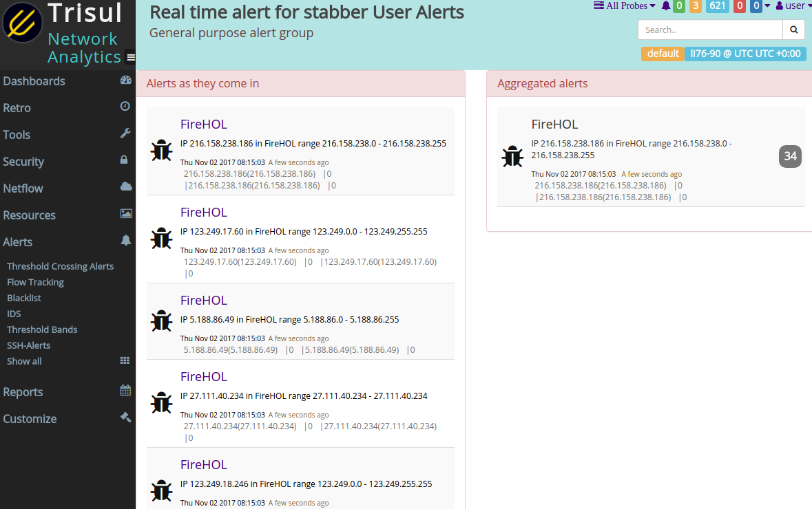

# FireHOL Checker

Check all your traffic against the excellent FireHOL Level1 blacklist. The FireHOL list has a reputation for a very low false positive rate.  **If you see a FireHOL alert in Trisul, you MUST investigate further.**  To help the analyst further, this app elevates the alert priority to 1 when bi-directional data transfer above a threshold occurs with a blacklisted host. 

> **Update 18-Aug-2018** Script to automate installation of feed in one step 

1. FireHOL Level1 is a must block list of IPs , this app detects activity and creates a HIGH Priority Alert if it finds a hit
2. FireHOL Level3 is a also a list of malicious IPs, this app will scan that as well and create a LOW Priority Alert. If there is significant data transfer in both directors it will escalate the priority to HIGH.


## Installing 

To install this APP logon as admin, then select APP from _Web Admin > Manage > Apps._

Post install ,  run the `installfeed.sh` script to keep the FireHOL list updated. 


### 1. Installing the feed 

Run the `installfeed.sh` script in this folder  to install the FireHOL feeds and update the CRON to download every hour 

Cut paste the below

````
curl -O  https://raw.githubusercontent.com/trisulnsm/apps/master/analyzers/firehol/installfeed.sh
bash ./installfeed.sh 
````


### 2. Restart probe

Login as admin , go to Context : default > Admin Tasks > Start/Stop Tasks. Restart the probe
This APP checks the MD5 of the two Intel files before every stream window (approx 1 minute). If they change , they are refreshed immediately.

Config Parameters
==============

The config settings you can customize on a per Probe basis

````lua

DEFAULT_CONFIG = { 

  -- filename of FireHOL level1 Feed  - will trigger Sev-1 alert 
  Firehol_Filename_Level1 ="firehol_level1.netset",

  -- optional level3 - will create Sev-3 alert 
  Firehol_Filename_Level3 ="firehol_level3.netset",

  -- How much should blacklisted IP Recv for Priority elevation to MAJOR (1)
  Vol_Sev1_Alert_Recv=10000,

  -- How much should blacklisted IP Transmit for Priority elevation to MAJOR (1)
  Vol_Sev1_Alert_Xmit=20000,
}
````

To supply your own custom settings, 

1. create a new config file named `trisulnsm_filehol.lua` in the probe config directory
`/usr/local/var/lib/trisul-probe/domain0/probe0/context0/config` directory with the following
2. You only supply new values for parameters you want to replace 
3. An example here , we want to increase the `Vol_Sev1_Alert`  threshold to 50KB for escalation to HIGH priority


````lua 

# in file /usr/local/var/lib/trisul-probe/domain0/probe0/context0/config/trisulnsm_filehol.lua 

return  {

  -- How much should blacklisted IP Recv for Priority elevation to MAJOR (1)
  Vol_Sev1_Alert_Recv=50000,
}

````

## Viewing alerts

The FireHOL alerts show up in Trisul as User-Alerts.

1. View alerts real time. Select Alerts > Show All > User Alerts > Click on "View Real Time" 
2. View older alerts. Select Alerts > Show All > click on User Alerts


 


UPDATES
=======

````
0.0.6   Oct 4  2018     file handle leak fix in popen()
0.0.5   Aug 18 2018     installfeed.sh to automate Feed download and Cron
0.0.3   Feb 15 2018     Added FireHOL-Level3 support 
0.0.2   Nov 2  2017      Custom options 
0.0.1   Oct 30 2017     Initial release 
````


