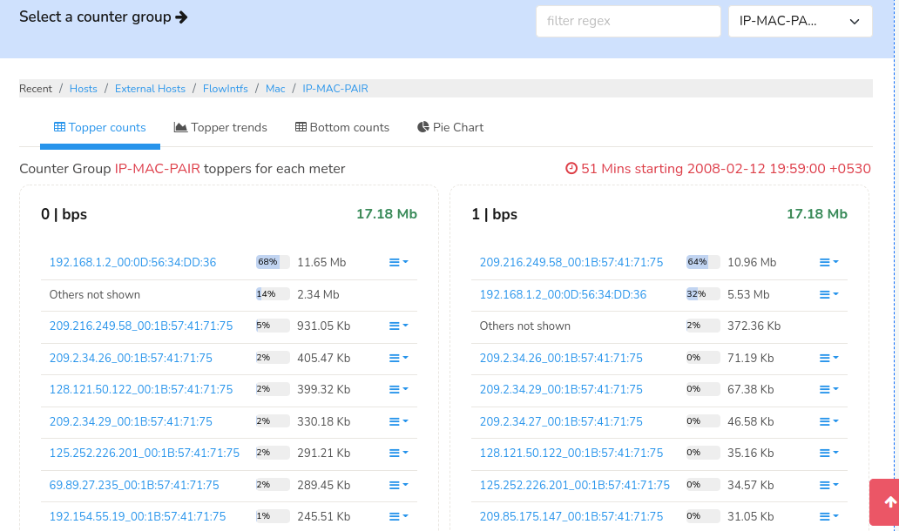
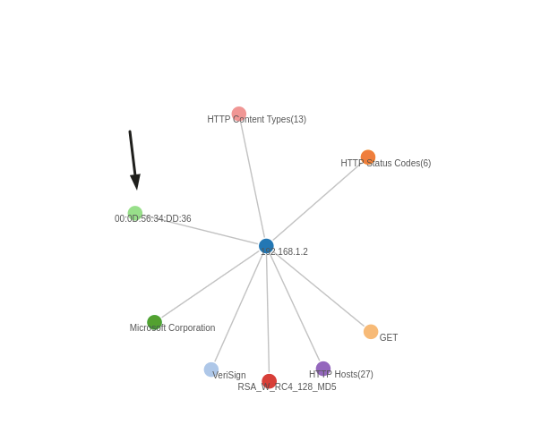

# IP to MAC mapper

Tracks IP addresses to MAC address mappings.

This works by monitoring source MAC to source IP and dest MAC to dest IP pairs. All IP upstream of a router interface will show the router MAC obviously.  For that reason this APP is most suitable in a switched environment. 

## How it works

### A new counter group called IP-MAC-PAIR. 

This counts directional traffic with the following key format IP_MAC
You can retrieve toppers for this group and extract the mappings yourselves.



### EDGE analytics 

Edges are added for IP to MAC and MAC to IP pairs.


- Go to Tools > Edge
- Select "Hosts" and enter IP Address to see MACs using that IP
- Select "MAC" and enter MAC Address to see IPs behind that MAC 





# Version History

````
0.0.1   Aug  5 2022     Initial version 

````
