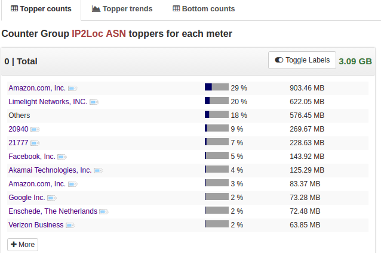

# IP2Location LITE Geo Metrics  

This app adds Geo based metering to Trisul using the [IP2Location LITE databases](https://lite.ip2location.com/)

The following CSV databases are processed by this app.

1. **ASN-LITE** - for Autonomous System Number metrics 
2. **DB3-LITE** - for Country and City 
3. **P2-LITE**  - for Proxies 

## Installing 

To install this APP logon as admin, then select APP from _Web Admin > Manage > Apps._

### 1. Install the IP2LOCATION databases 

> To proceed further you need to obtain a `DOWNLOAD_TOKEN` from the [IP2Location website](https://lite.ip2location.com/) 

Get the installer script `installfeed.sh` to download and compile the databases as shown below.

````
curl -O  https://raw.githubusercontent.com/trisulnsm/apps/master/analyzers/ip2location/installfeed.sh
bash installfeed.sh DOWNLOAD_TOKEN
````

> *5 minutes* The compilation can take up to 5 minutes. Please be patient. 

### 2. Restart probe

Login as admin , go to Context : default > Admin Tasks > Start/Stop Tasks. Restart the probe

## Manual lookup using the checkip tool

The app includes the `checkip.lua` tool , you can run this manually to look up ANY ip from the command line

````
root@ubuntu16prod# luajit checkip.lua 193.77.148.62

IP2Location Report for IP 193.77.148.62
Key  :C1.4D.94.3E
ASN  :5603 Formerly SiOL Internet d.o.o.
CTRY :SI Slovenia
CITY :SI_Metlika

````

## Viewing data 

This app creates four new counter groups starting with "IP2LOC-Country/ASN/City/Proxy". Go to Retro > Counter to start your analysis.



## Cron updates


Use the script `installfeed.sh` to update the list every week.  You have to supply the DOWNLOAD_TOKEN

````sh
crontab -e -u trisul

# then add this line 
0 0 * * * /usr/local/share/trisul-probe/plugins/installfeed.sh 
````

The updates are automatically picked up.  

## Notices

from IP2Location website 

````
All sites, advertising materials and documentation mentioning features or use of this database must display the following acknowledgment:

"This site or product includes IP2Proxy LITE data available from https://www.ip2location.com/proxy-database."
"This site or product includes IP2Proxy ASN  data available from https://www.ip2location.com/asn-database."
````


UPDATES
=======

````
0.0.7       Apr 6  2019         Supports DB1 (Country Only) mode and better install experience 
0.0.6       Jan 19 2019         Added STATE within country wise 
0.0.5       Aug 17 2018         Added a helper script installfeed.sh to prepare the lists and
                                flow per ASN,Country,City,Proxy
0.0.3       May 23 2018         Added cron script to DL and compile 
0.0.2       May 22 2018         Initial release 
````


