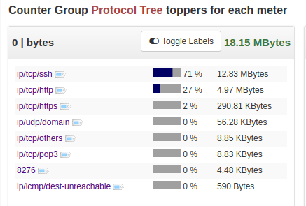
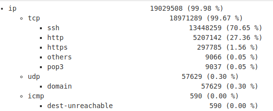

Protocol Tree Metrics generator
============================

A protocol tree metrics provides you a tree-like view of protocol usage in your network.

Pop this Trisul APP into your network and gain this type of visibility. 


## Typical Top-K 

A normal Top-K report only provides the end protocol.

```
ssh 13448259    (70.65 %) 
http 5207142    (27.36 %)
https 297785    (1.56 %) 

```


## Protocol Tree Top-K

A protocol tree Top-K report provides a breakup of the tree for each application including the lower level protocols.

```

ip 19029508 (99.98 %) 37334 (99.76 %)
    tcp 18971289    (99.67 %) 37006 (98.88 %)
       ssh      13448259    (70.65 %)     27315 (72.99 %)
       http      5207142    (27.36 %)      9051 (24.19 %)
       https      297785     (1.56 %)       404 (1.08 %)
       others       9066     (0.05 %)       107 (0.29 %)
       pop3         9037     (0.05 %)       129 (0.34 %)
    udp 57629   (0.30 %) 327 (0.87 %)
       https      297785     (1.56 %)       404 (1.08 %)
       domain      57629     (0.30 %)       327 (0.87 %)
    icmp 590    (0.00 %) 1 (0.00 %)
        dest-un     590      (0.00 %) 1 (0.00 %)
ip6 19029508    (99.98 %) 37334 (99.76 %)
    tcp 18971289    (99.67 %) 37006 (98.88 %)
       ssh      13448259     (70.65 %)    27315 (72.99 %)

```

## Using

Go to Retro -> Retro Counters, select a time frame and then Protocol Tree 

After installing the app go to Dashboards > View All > Protocol Tree 



## Install the Protocol Tree Dashboard for an even better view

Install the companion JS Trisul Dashboard "Protocol Tree" to get the following type of dashboard




UPDATES
=======

````
0.0.2   Mar 12 2019     Updated sweepbuf to new version 
0.0.1   Sep 18 2018     Initial version of APP
````


