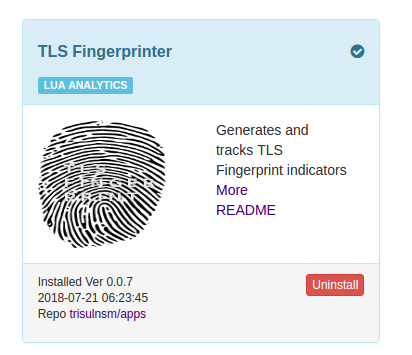
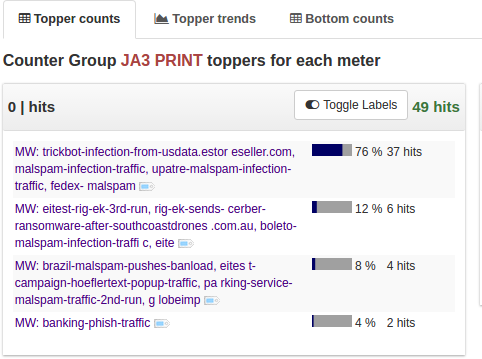
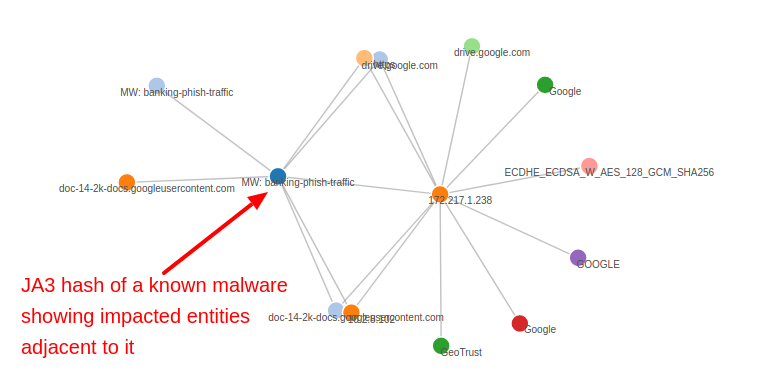

# TLS Fingerprinter

This Trisul APP adds TLS Fingerprinting capability to TrisulNSM. 

> *New*  Added JA3 Server Hash 

TLS fingerprinting is a network analytics technique to intelligently guess a SSL/TLS client which may not otherwise be possible due to encryption.  Use this to detect rogue clients with known prints, to build a profile of known clients for whitelisting, or as an indicator to be used in combination with other techniques.  It is a good piece of info to have particularly when 90% of enterprise traffic these days are encrypted.  This uses the JA3 Hash (see below) 


Links:
1. Trisul [IOC Based on TLS Fingerprinting](https://github.com/trisulnsm/trisul-scripts/tree/master/lua/frontend_scripts/reassembly/ja3)
2. The work by [Lee Brotherston](https://github.com/synackpse/tls-fingerprinting)
3. The JA3 Hash described by [John Althouse](https://github.com/salesforce/ja3) 


## Installing 

1. Logon as admin, then select _TLS Fingerprinter_  from  _Web Admin > Manage > Apps._ to install
2. Restart the Trisul Probes 

 

### 1. The TLS Fingerprint database 

The App uses a stock TLS Fingerprint JSON database located at  the following location

````
# stock database 
/usr/local/var/lib/trisul-config/domain0/context0/profile0/lua/github.com_trisulnsm_apps
````

If you have a different JSON database you can put it in the share directory at the following location. 

````
# custom database, this is loaded if present first 
/usr/local/share/trisul-probe/plugins/tls-fingerprints.json 
````

### 2. Custom options : Logging hashes per flow 

You can choose to log the { SSL Flow + JA3 Hash + JA3 print } on a per flow basis for troubleshooting. 
By default this option is turned off, to enable 

````
# create a file named /usr/local/var/lib/trisul-probe/domain0/probe0/context0/config/trisulnsm_tls-fingerprint.lua"
# put the lines below in that file 


return {
		-- logs for each TLS flow the FlowID, JA3-Hash, JA3-String
		-- default is false, override if you want to debug or harvest strings in  the following file
        -- /usr/local/var/lib/trisul-probe/d0/p0/cX/config/trisulnsm_tls-fingerprint.lua  config file 
        LogHashes=false,
} 

````

## Screenshots 


### Top-K and Bottom-K

The following screenshot shows the metrics for each fingerprint seen.  For _resolved fingerprints_ you will see the name, for unresolved the raw MD5 print. You can click on the button for further exploration.

 

### EDGE - graph analytics

The following screenshot shows Trisul EDGE Graph analytics, you can click on a fingerprint and expose the adjacent vertices such as which IP addresses, Ports, Servers, SNI, Certificates are related to the print. 

 

## Using 

The APP adds a new Counter Group called "JA3 Print" 

1. Use Retro > Retro Counters, then select _JA3 Print_  to show time distribution of each fingerprint seen.
2. Click and select _View Edges_ to explore deeper using Trisul's streaming graph analytics 
3. If you want to discover and tag new prints, consult Trisul LUA Wiki for examples 
4. Flows are tagged with first 8 characters of JA3 Hash 


UPDATES
=======

````
0.0.8   Aug 8  2018     Added JA3 Server Hash  and option to print to log file 
0.0.7   Jul 3  2018     Minor error when no extensions are present. We cant do FP for that.
0.0.6   Jun 28 2018     Dont log all hashes, instead update_key info if user wants to see JA3 string 
                        for a given JA3 hash 
0.0.5   Jun 23 2018     FFI tries 2 libcrypto versions to run on CentOS7/Ubuntu16
0.0.4   Mar 01 2018     Updated with 50+new prints
                        Adds Flow Tags with first 6 chars of JA3 Hash
                        Handle very long descriptions 
0.0.3   Jan 08 2018     Updated with 150+ newprints 
                        Adds a new Edge to Graph Analytics when no SNI hostname is present.
                        Adds  Bottom-K JA3 prints in addition to Top-K to the streaming analytics 
0.0.1   Nov 10 2017     Initial release 
````


