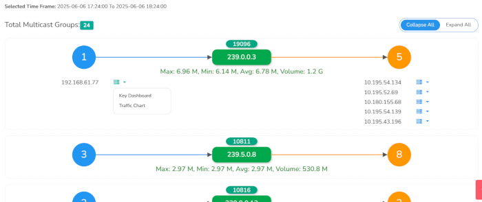

#  Multicast GraphX

Multicast GraphX is a beautiful and interactive layout presentation built with d3.js of multicast traffic. 

Target users of this tool are securities and other financial services providers who have a lot of multicast traffic on their network.

> A common failure of current generation network analytics tools is to properly present multicast traffic flows. Using the IGMP-Multicast Trisul App, our customers were able to combine protocol level analysis of the IGMP traffic and combine that with traffic metrics from packet or NetFlow analytics. This tool is provides the best visual representation of multicast flows today. 

##  Prerequisites - IGMP Multicast App

This app requires the `IGMP Multicast` app to be installed and active.

##  Overview

Track each multicast flow separately 
Easily explore the unicast IPs involved in  **sending** and **receiving** multicast traffic  
Get traffic intelligence like **bitrate**, **volume**, and **flow dynamics**  
Filter multicast activity by **IP** or **Port**

##  Key Features

- Visualize all active **Multicast Groups** within a selected time range  
- Group center node shows **Multicast IP** and **Port**
- Left bubble → **Sender Count**  
- Right bubble → **Receiver Count**
- Click on any bubble to expand sender/receiver **IP list**
- Each sender/receiver has a **dropdown menu** with:
  -  **Traffic Chart** (View bitrate timeline)
  -  **Key Dashboard** (Jump to Trisul key dashboard)
- Display real-time stats:
  - **Max**, **Min**, **Avg** rate  
  - **Total Volume** of traffic  

## Screenshots

>  Screenshot 

## CHANGELOG

| Version | Release Date | Description |
|---------|--------------|-------------|
| `v1.0.0` | 09-JUN-2025 | Initial release to public |
| `v1.0.1` | 10-JUN-2025 | Added search form |
| `v1.0.2` | 13-JUN-2025 | Enhanced filtering with host & multicast crosskey |
| `v1.0.3` | 19-JUN-2025 | Readme update, now displays port on group |

