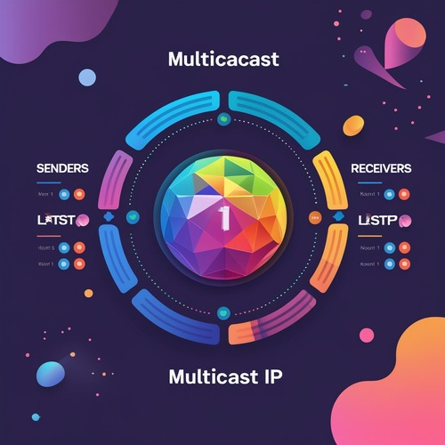

# 🌐 Multicast GraphX

> A powerful IGMP Multicast visualization tool for TrisulNSM users

Multicast GraphX provides an **intuitive graphical view** of IGMP multicast traffic across your network. Designed for network operators using TrisulNSM, this app helps you instantly identify active **Multicast Groups**, **Senders**, and **Receivers**, all in a beautiful and interactive layout.

---

## 🎯 Overview

📡 Easily explore who is **sending** and **receiving** multicast traffic  
🧠 Get traffic intelligence like **bitrate**, **volume**, and **flow dynamics**  
🔎 Search multicast activity by **IP** or **Port**

---

## ✨ Key Features

- ✅ Visualize all active **Multicast Groups** within a selected time range  
- 🎯 Group center node shows **Multicast IP** and **Port**
- 🔵 Left bubble → **Sender Count**  
- 🟠 Right bubble → **Receiver Count**
- 📂 Click on any bubble to expand sender/receiver **IP list**
- 🔽 Each sender/receiver has a **dropdown menu** with:
  - 📊 **Traffic Chart** (View bitrate timeline)
  - 📌 **Key Dashboard** (Jump to Trisul key dashboard)

- 🧠 Display real-time stats:
  - **Max**, **Min**, **Avg** rate  
  - **Total Volume** of traffic  

---

## 🧩 Prerequisites

To use this app, ensure the following:

### 🔌 IGMP Multicast App

This app requires the `IGMP Multicast` app to be installed and active.

➡️ **To install:**

1. Login as **admin** in WebTrisul  
2. Go to the **Trisul Apps** page  
3. Find and install the **IGMP Multicast** app  
4. Make sure your **probe is running**

---

## 📸 Screenshots

> 🖼️ Sample visualization of multicast groups and traffic stats:

> 🖼️ App Thumbnail:

---

## 🔍 How to Use

### 1. 🔎 **Search Form**
At the top:
- ⏱️ Select a **time frame**
- 🔑 (Optional) Enter a **Multicast IP** (e.g., `239.0.0.3`) or **Port** (e.g., `19096`)  
- Leave the filter blank to display **all multicast groups**

### 2. 🧾 **Result Summary**
- View total **multicast groups**
- For each group:
  - 🟩 Center: Multicast IP + Port
  - 🔵 Left Bubble: Sender Count
  - 🟠 Right Bubble: Receiver Count

- Click on sender/receiver bubbles to expand the list:
  - Each IP includes a **dropdown menu**:
    - 📈 **Traffic Chart** — view traffic graph over time
    - 🔍 **Key Dashboard** — jump to Trisul’s key-specific dashboard

### 3. 📈 **Traffic Stats**
Every group displays:
- **Max**, **Min**, **Avg** transfer rate  
- **Total Volume** in MB/GB

---

Then restart `probe`:

---

## 🗓️ CHANGELOG

| Version | Release Date | Description |
|---------|--------------|-------------|
| `v1.0.0` | 09-JUN-2025 | Initial release to public |
| `v1.0.1` | 10-JUN-2025 | Added search form |
| `v1.0.2` | 13-JUN-2025 | Enhanced filtering with host & multicast crosskey |
| `v1.0.3` | 19-JUN-2025 | Readme update, now displays port on group |

---

## 📊 Repo Stats

![dark][dark_repo]

[dark_repo]: https://github-readme-stats.vercel.app/api/pin/?username=trisulnsm&repo=apps&cache_seconds=86400&theme=dark

---

## 🙌 Contributing

We welcome contributions to improve Multicast GraphX!  
Feel free to:
- 🐛 Report issues
- 🧩 Submit pull requests
- 💡 Suggest enhancements

