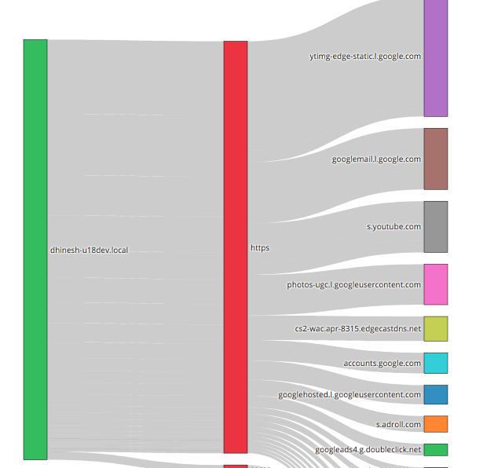

# Sankey Crossdrill App


> NEW  : Added Table output, Parameter for default counter group, slider to select number of nodes

This visualization lets to visualize any [Cross Key counter group](https://trisul.org/docs/ug/cg/custom.html#cross_key_counter_groups) metrics in the form of a Sankey diagram.




UPDATES
=======

````
2.0.20   Jul 17  2022     major improvement automatic cross drill menu intg
0.0.12   Apr 12  2019     added slider to control node count and table output
````


